# 💜 PhonePe Transaction Insights

> End-to-end EDA project on India's digital payments ecosystem — ETL pipeline, SQLite database, 15 static charts, and an interactive Streamlit dashboard.


[](https://phonepe-insights-027.streamlit.app/)
---

## 📌 What This Project Does

Pulls the official **PhonePe Pulse** open dataset (2018–2024, ~500 MB of JSON) from GitHub, parses 9 table types, stores everything in a local **SQLite database**, and surfaces insights through:

- **15 static EDA charts** (Matplotlib + Seaborn) saved as PNGs
- **Interactive Streamlit dashboard** (Plotly) with 6 pages and sidebar filters

---

## 📁 Project Structure

```
phonepe_insights/
│
├── src/
│   ├── etl.py           ← Clone repo → Parse 9 JSON tables → Load SQLite
│   └── analysis.py      ← Generate all 15 EDA charts → Save to outputs/
│
├── dashboard/
│   └── app.py           ← Streamlit dashboard (6 pages, Plotly charts)
│
├── data/                ← Auto-created by etl.py
│   ├── pulse/           ← Cloned PhonePe Pulse repo (~500 MB)
│   └── phonepe_pulse.db ← SQLite database (9 tables)
│
├── outputs/             ← Auto-created by analysis.py
│   └── chart01_*.png … chart15_*.png
│
├── requirements.txt
└── README.md
```

---

## ⚡ Quick Start

### 1. Install Dependencies

```bash
pip install -r requirements.txt
```

### 2. Run ETL Pipeline

> ⚠️ Requires internet on first run — downloads ~500 MB from GitHub.

```bash
python src/etl.py
```

Expected output:
```
✅ aggregated_transaction    →   94,500 rows
✅ aggregated_user           →  180,000 rows
✅ aggregated_insurance      →   12,600 rows
✅ map_transaction           →  420,000 rows
...
✅ SQLite DB ready: data/phonepe_pulse.db
```

### 3a. Generate Static Charts

```bash
python src/analysis.py
```

All 15 PNGs saved to `outputs/`.

### 3b. Launch Interactive Dashboard

```bash
streamlit run dashboard/app.py
```

Opens at **http://localhost:8501** — no internet needed after ETL.

---

## 📊 The 15 EDA Charts

| # | Title | Chart Type | Key Insight |
|---|-------|-----------|-------------|
| 1 | Top 10 States by Transaction Amount | Bar | Telangana, Karnataka, Maharashtra lead |
| 2 | Payment Category Distribution | Pie × 2 | P2P = 77% of value, Merchant = 55% of count |
| 3 | Quarterly Transaction Growth | Dual-axis Line | Exponential curve from 2020 onward |
| 4 | State × Year Heatmap | Heatmap | All top states compound fast post-2021 |
| 5 | Type × Quarter Stacked | Stacked Bar | P2P dominates; Merchant share growing |
| 6 | Device Brand Distribution | Bar + Pie | Xiaomi 25%, Samsung 20%, Vivo 18% |
| 7 | Insurance Growth | Dual-axis Line + Bar | Surged from 2020-Q2, still early-stage |
| 8 | Registered Users vs App Opens | Scatter + Trend | UP below trend = re-activation opportunity |
| 9 | Year-over-Year Growth | Grouped Bar | 278% in 2019; moderating but still 55% in 2024 |
| 10 | Top 15 States by Users | Horizontal Bar | Maharashtra leads at ~430M registered users |
| 11 | Amount Distribution Box Plot | Log-scale Box | Financial Services = widest IQR, highest outliers |
| 12 | Seasonality Analysis | Side-by-side Bar | Q4 (Oct–Dec) peaks — Diwali effect every year |
| 13 | Top 15 Districts | Horizontal Bar | Bengaluru Urban District #1 by a wide margin |
| 14 | Correlation Heatmap | Triangular Heatmap | Txn Amount & Count r=0.99; Engagement independent |
| 15 | Pair Plot — Key Variables | KDE Pair Plot | 3 state tiers clearly separable in log space |

### Chart Previews

**Chart 1 — Top 10 States by Transaction Amount**
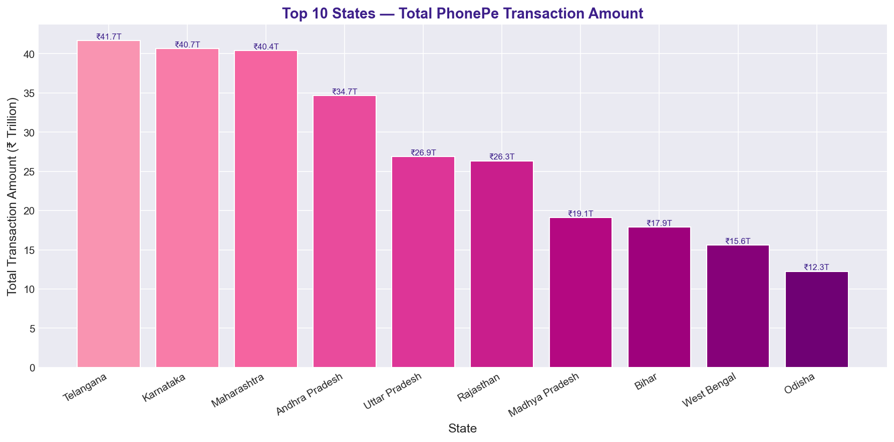

**Chart 2 — Payment Category Distribution**
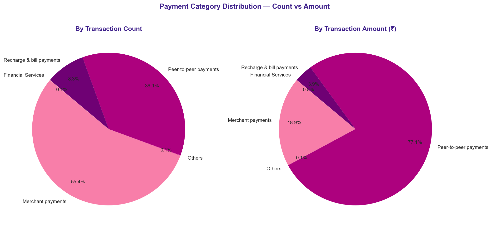

**Chart 3 — Quarterly Transaction Growth**
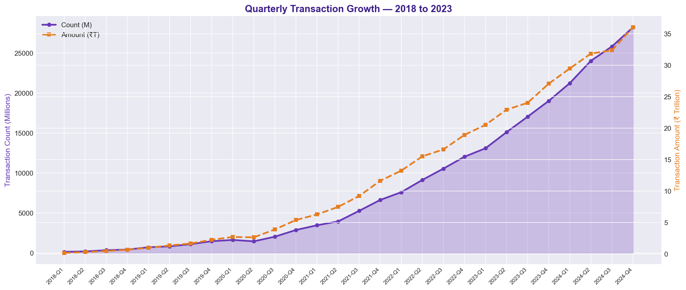

**Chart 4 — State × Year Heatmap**
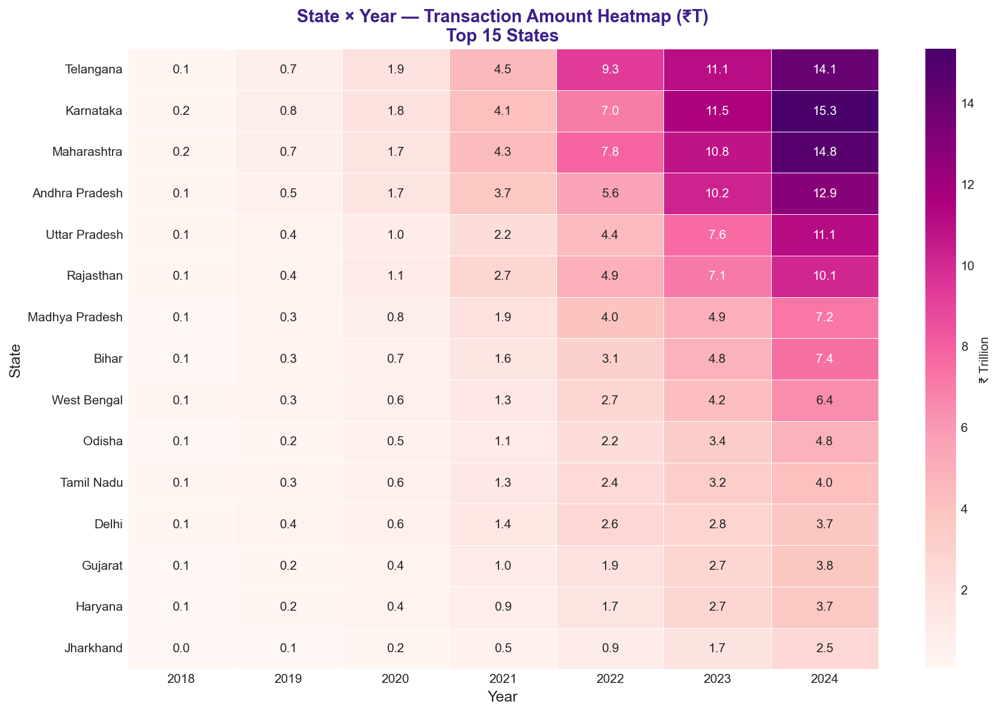

**Chart 5 — Stacked Type by Quarter**
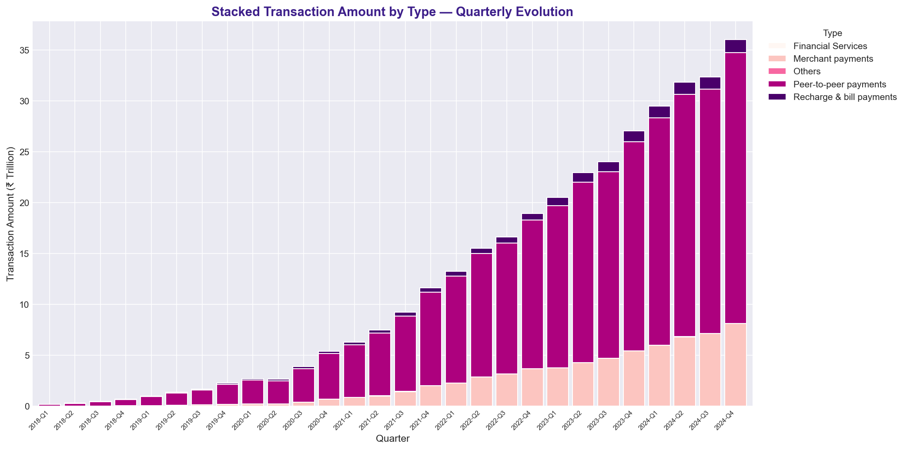

**Chart 6 — Device Brand Distribution**
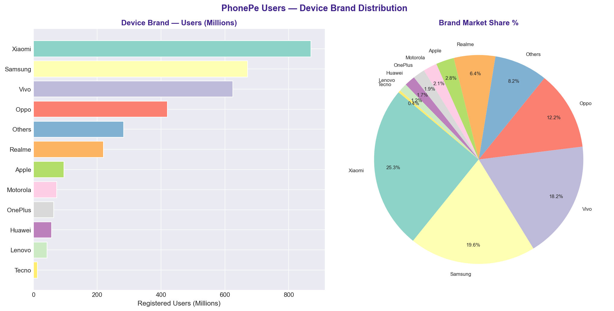

**Chart 7 — Insurance Growth**
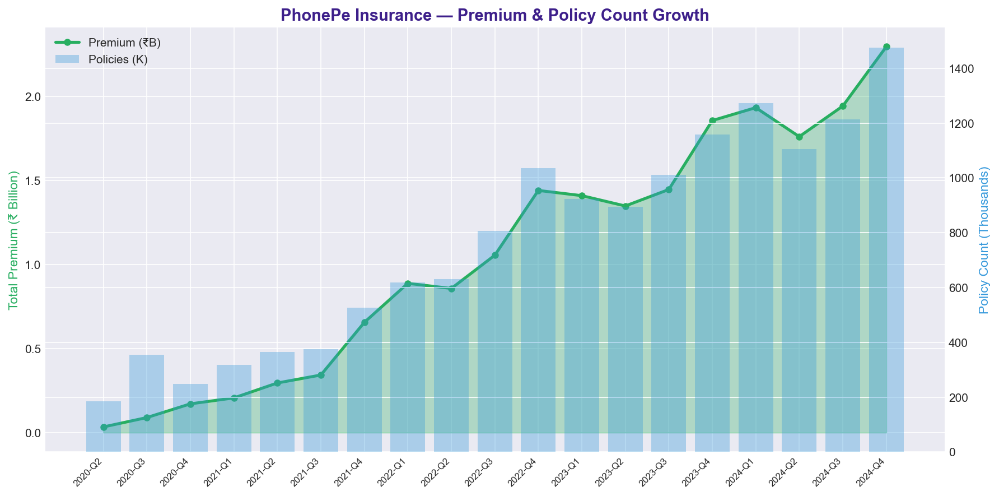

**Chart 8 — Registered Users vs App Opens**
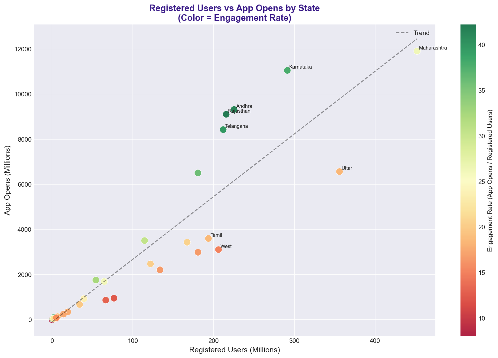

**Chart 9 — YoY Growth Rate**
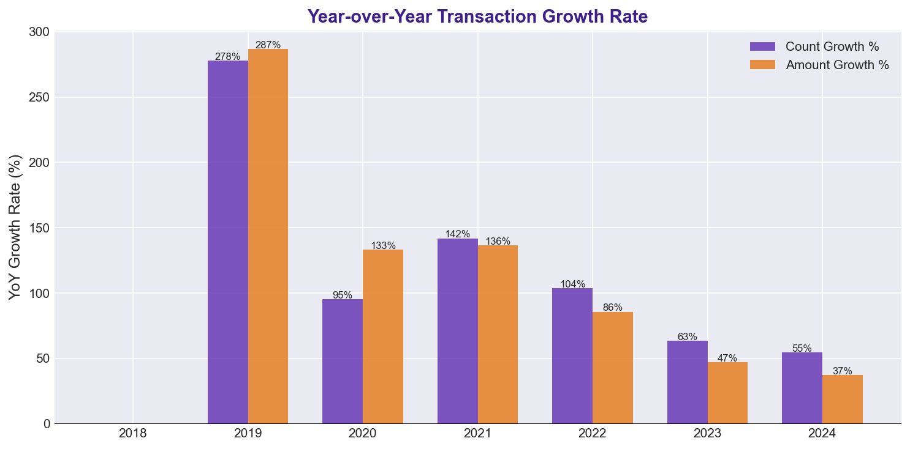

**Chart 10 — Top 15 States by Registered Users**
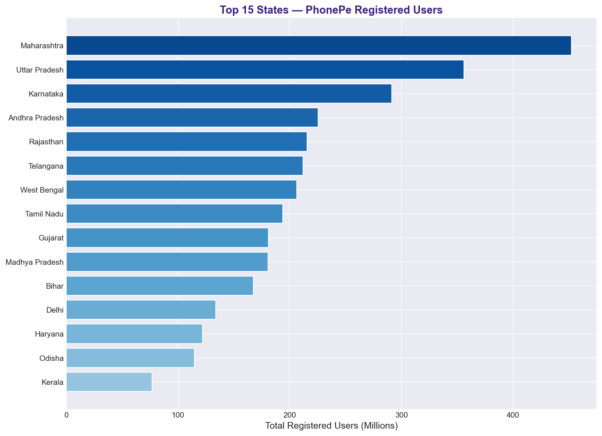

**Chart 11 — Transaction Amount Box Plot**
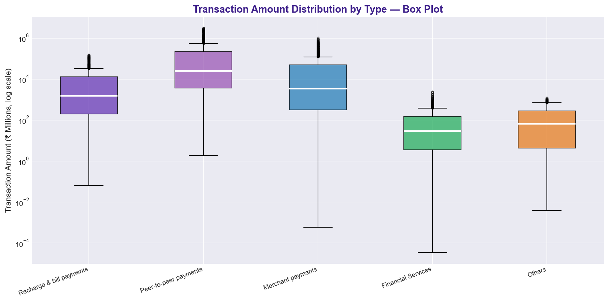

**Chart 12 — Seasonality Analysis**
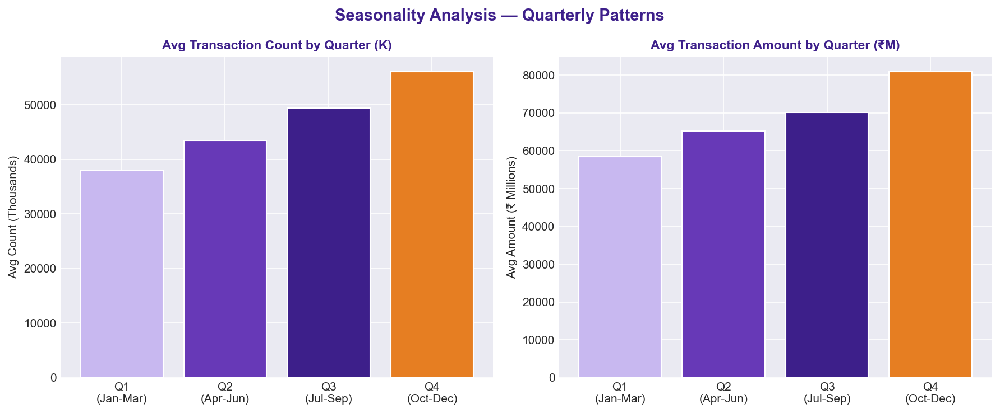

**Chart 13 — Top 15 Districts**
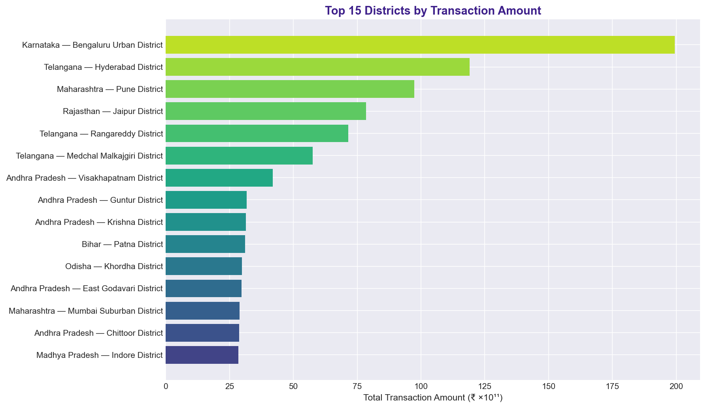

**Chart 14 — Correlation Heatmap**
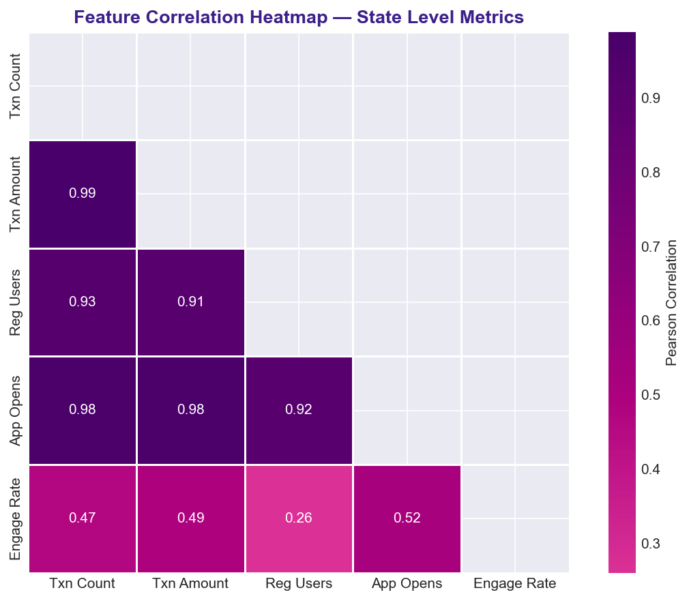

**Chart 15 — Pair Plot**
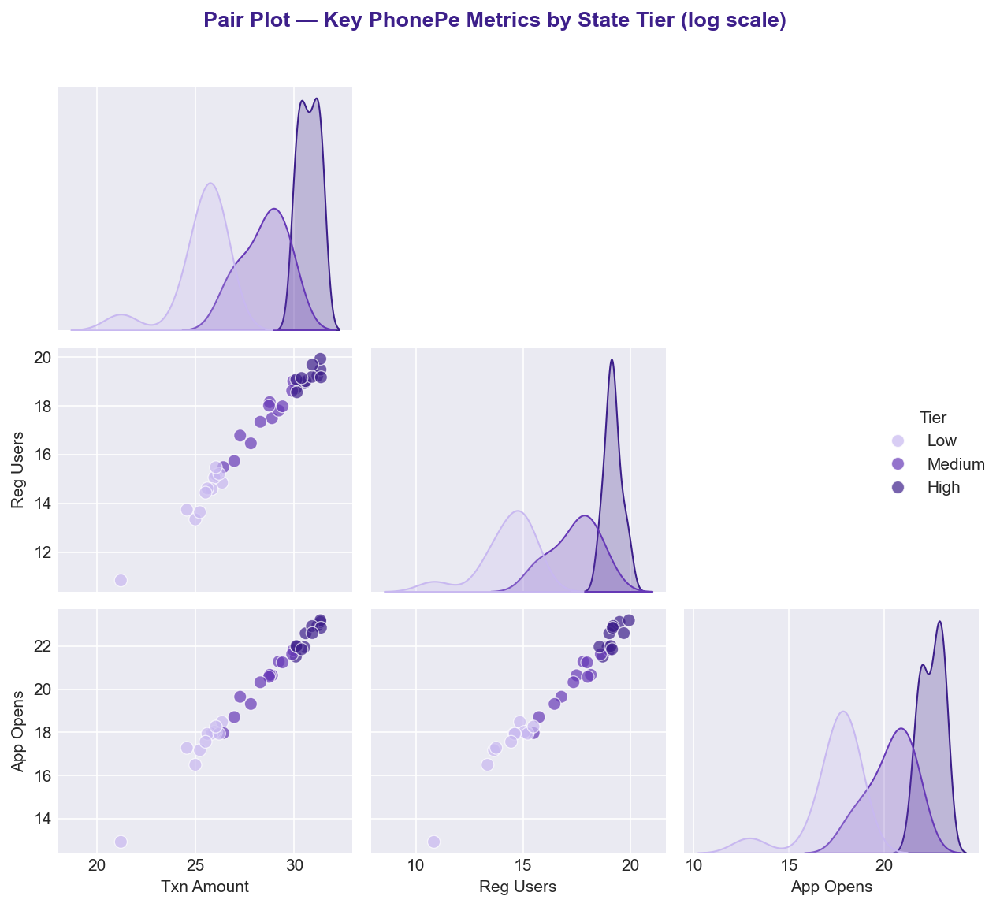

---

## 🎛️ Streamlit Dashboard Pages

| Page | What's Inside |
|------|--------------|
| 🏠 Overview | KPI metrics (₹T volume, B transactions, M users), trend sparkline, key insights, table summary |
| 📊 Transactions | Top states bar, type pie, quarterly dual-axis trend, stacked quarterly view |
| 👤 Users & Devices | Brand bar + pie, engagement rate by state, registered vs app-opens scatter |
| 🗺️ Geographic | Top 20 districts and top 15 pincodes by transaction amount |
| 🛡️ Insurance | Premium + policy count trend, top states by premium (filter-aware) |
| 📈 Growth & Trends | YoY growth grouped bar, Q1–Q4 seasonality, log-scale box plot |

Sidebar lets you filter by **Year** and **Quarter** — all charts update live.

---

## 🗄️ Database Schema

| Table | Granularity | Key Columns |
|-------|------------|-------------|
| `aggregated_transaction` | State | year, quarter, transaction_type, count, amount |
| `aggregated_user` | State × Brand | year, quarter, brand, brand_count, registered_users, app_opens |
| `aggregated_insurance` | State | year, quarter, insurance_type, count, amount |
| `map_transaction` | District | year, quarter, district, count, amount |
| `map_user` | District | year, quarter, district, registered_users, app_opens |
| `map_insurance` | District | year, quarter, district, count, amount |
| `top_transaction` | Pincode | year, quarter, pincode, count, amount |
| `top_user` | District (Top) | year, quarter, district, registered_users |
| `top_insurance` | Pincode | year, quarter, pincode, count, amount |

---

## 💡 Key Business Findings

1. **Geographic Opportunity** — UP and Bihar have 350M+ registered users but well below-trend app opens → "First Transaction Incentive" campaigns have near-zero acquisition cost
2. **Merchant Ecosystem** — Merchant payments growing as share of total; super-app tools (GST, loyalty) can accelerate stickiness
3. **Insurance Cross-sell** — Premiums growing 40× from 2020–2024; contextual triggers (post-travel booking, tax season) can drive rapid adoption
4. **Seasonality Planning** — Q4 spikes every year; capacity scaling from September is operationally critical
5. **OEM Partnerships** — Xiaomi + Samsung + Vivo = ~63% of user base; bundling agreements are high-leverage growth levers
6. **Financial Services** — Widest amount distribution and highest outliers; per-type fraud thresholds reduce false positives significantly

---

## 🛠️ Tech Stack

| Layer | Technology |
|-------|-----------|
| Data Source | PhonePe Pulse GitHub (JSON) |
| ETL | Python · GitPython |
| Storage | SQLite (`sqlite3`) |
| Analysis | pandas · NumPy |
| Static Viz | Matplotlib · Seaborn |
| Interactive Dashboard | Streamlit · Plotly |

---

## 📌 Notes

- Dataset covers **2018–2024** (28 quarters as of latest pulse update)
- All amounts in raw INR; charts auto-convert to M / B / T for readability
- Dashboard reuses the SQLite DB if already present — no re-cloning needed
- If `ModuleNotFoundError: gitpython` appears, run `pip install gitpython`

---

## 📄 Data Source

[PhonePe Pulse](https://github.com/PhonePe/pulse) — open-sourced by PhonePe under the [CDLA-Permissive-2.0 License](https://github.com/PhonePe/pulse/blob/master/LICENSE).
